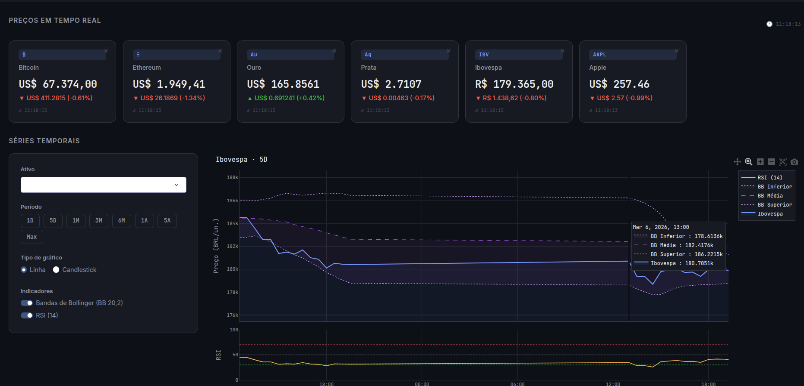
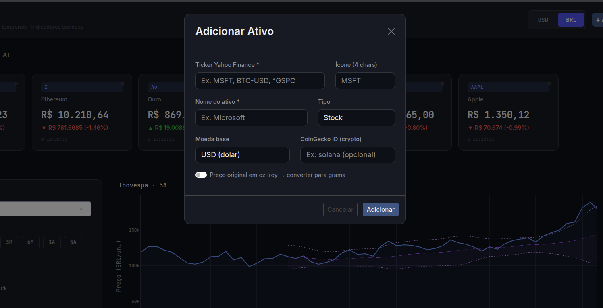
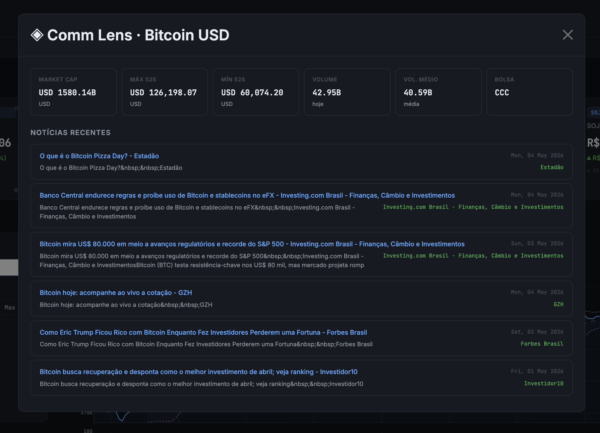
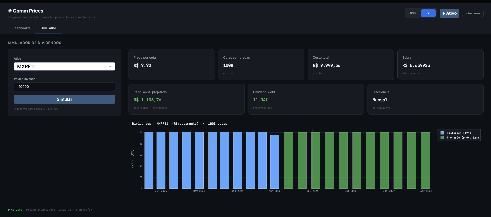

# comm-prices

Plataforma pessoal para centralização e acompanhamento e análise de portfólio de investimentos em tempo real.

A proposta é centralizar em um único lugar tudo que você precisa para gerenciar seus ativos: cotações ao vivo, análise técnica, indicadores fundamentalistas, notícias do mercado e simulações de rendimento. O usuário cadastra seus próprios ativos — ações, cripto, ETFs, FIIs, índices ou commodities — e a plataforma cuida do resto.

Todos os dados são puxados em tempo real por múltiplas APIs:

| Fonte | Dados |
|---|---|
| **Yahoo Finance** (`yfinance`) | Cotações, histórico OHLCV, câmbio USD/BRL, indicadores fundamentalistas |
| **CoinGecko** | Preço spot e variação 24h de criptomoedas (sem API key) |
| **Google News RSS** | Notícias recentes sobre cada ativo (fallback Yahoo Finance) |

**Stack**: Python · Dash · Plotly · yFinance · CoinGecko · Google News RSS

---


Dashboard pra acompanhar preços de ativos em tempo real. Roda local, abre no browser.

## Telas

### Dashboard principal



Tela central do app. No topo ficam os **cards de preço** com cotação ao vivo, variação absoluta e percentual em relação ao fechamento anterior, e o horário da última atualização. Abaixo fica a seção de **Séries Temporais**: à esquerda um painel com seletor de ativo, botões de período (1D · 5D · 1M · 3M · 6M · 1A · 5A · Max), escolha entre gráfico de linha ou candlestick, e switches para ativar Bandas de Bollinger (BB 20,2) e RSI (14). O gráfico usa subplots — quando o RSI está ativo ele aparece como um painel separado abaixo do gráfico principal. No canto superior direito fica o relógio ao vivo.

### Modal de adição de ativo



Aberto pelo botão **+ Ativo** no cabeçalho. Campos disponíveis:

### Comm Lens — detalhes e notícias do ativo



Modal que abre ao clicar em um card de ativo. Exibe dados fundamentalistas do ativo (Market Cap, Máx/Mín 52 semanas, Volume do dia, Volume médio e Bolsa), seguidos de uma seção **Notícias Recentes** com manchetes buscadas via Google News RSS (fallback Yahoo Finance), com título, trecho, fonte e data de cada artigo.

### Simulador de Dividendos



Aba separada acessível pela navegação **Dashboard / Simulador** no topo. Permite informar um ativo (ações, ETFs, FIIs) e um valor a investir, e calcula:

- **Cotas compradas** e **sobra** não investida
- **Rend. anual projetado** com base nos dividendos históricos
- **Dividend Yield** projetado (12 meses)
- **Frequência** de pagamento (mensal, trimestral etc.)

O gráfico de barras mostra o histórico de dividendos dos últimos 12 meses (azul) e a projeção para os próximos 12 meses (verde).

| Campo | Descrição |
|---|---|
| **Ticker Yahoo Finance** | Código do ativo (ex: `MSFT`, `BTC-USD`, `^BVSP`, `GC=F`) |
| **Ícone** | Até 4 caracteres exibidos no card (ex: `MSFT`, `₿`) |
| **Nome do ativo** | Label do card e do dropdown de gráfico |
| **Tipo** | `stock`, `crypto`, `commodity`, `index`, `etf` ou `outro` |
| **Moeda base** | `USD` ou `BRL` — define como a conversão é aplicada |
| **CoinGecko ID** | Opcional, só para crypto — melhora a precisão da variação 24h (ex: `solana`) |
| **oz troy → grama** | Switch para metais: converte o preço de onça troy para grama automaticamente |

## O que tem

- Preços ao vivo: BTC, ETH, Ouro (g), Prata (g), Ibovespa, Apple — busca em paralelo (ThreadPoolExecutor)
- Atualiza automaticamente a cada 10 segundos
- Toggle USD / BRL no cabeçalho — converte preços e variações, incluindo metais
- Adiciona e remove ativos em tempo real (qualquer ticker do Yahoo Finance)
- Estado persistente: ativos e moeda selecionada salvos no `localStorage` do browser
- Gráficos com Plotly: linha ou candlestick, 8 períodos de 1D até Max
- Bandas de Bollinger (BB 20,2) e RSI (14) ativáveis por switch
- Botão **↺ Restaurar** para voltar aos ativos padrão
- Relógio ao vivo e barra de status com horário da última atualização
- Layout responsivo — funciona em mobile/iPhone
- **Comm Lens**: modal com dados fundamentalistas + notícias recentes via Google News RSS (fallback Yahoo Finance)
- **Simulador de Dividendos**: calcula cotas, rendimento anual projetado, dividend yield e frequência de pagamento com gráfico histórico/projeção

## Como rodar

```bash
git clone https://github.com/GSMuller/comm-prices.git
cd comm-prices

python -m venv .venv
source .venv/bin/activate

pip install -r requirements.txt
python app.py
```

Abre em `http://localhost:8050`.

## Estrutura

```
app.py       — layout, callbacks e lógica de UI do Dash
data.py      — busca de preços (spot e histórico), Bollinger, RSI, formatação
config.py    — ativos padrão, períodos, tipos de ativo, constantes
assets/
  custom.css — estilo dark theme
Images/
  Index.png      — screenshot do dashboard principal
  Menu.png       — screenshot do modal de adição de ativo
  lens.png       — screenshot do Comm Lens (detalhes + notícias)
  simulador.png  — screenshot do Simulador de Dividendos
```

## Fontes de dados

- **Crypto**: CoinGecko (gratuito, sem key) com fallback pro Yahoo Finance via `yfinance`
- **Ações, índices, commodities**: Yahoo Finance via `yfinance`
- **Câmbio USD/BRL**: Yahoo Finance (`BRL=X`) com fallback de R$ 5,00

Os preços dependem da disponibilidade das APIs — fora do horário de mercado alguns ativos ficam estáticos.

## Dependências principais

```
dash, dash-bootstrap-components, plotly
yfinance, pandas, numpy, requests
```

## Deploy

O objeto `server = app.server` já está exposto em `app.py` para uso com gunicorn (Railway, Render, etc.):

```bash
gunicorn app:server
```

## Próximas ideias

- Alertas de preço
- Seção de portfólio com valor total
- Exportar histórico em CSV
